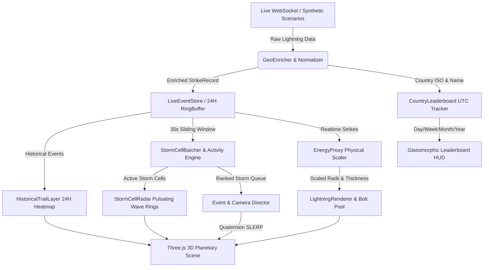

# ⚡ Lightning Globe — Planetary Realtime Monitoring Experience (v2.0)

[](https://www.typescriptlang.org/)
[](https://threejs.org/)
[](https://vitejs.dev/)
[](#-performans-ve-optimizasyon)
[](#-mimari-boru-hattı)
[](#)

> **Lightning Globe**, Dünya üzerindeki gerçek zamanlı yıldırım ve şimşek deşarjlarını uzay istasyonu perspektifinden sinematik bir görsel deneyime dönüştüren, yüksek performanslı bir 3D gezegen izleme ve meteorolojik analiz platformudur.

---

## 🌟 Öne Çıkan Özellikler

### 🚀 v2.0 Yeni Mimari Yetenekleri
- 🎯 **Anti-Drift Hedef Kilitlemeli Kamera (Faz 16):**
  - Yaklaşma tamamlandığında hedef merkezine (`controls.target.copy`) milimetrik kilitlenme.
  - Yapay rotasyon sapmalarından arındırılmış sıfır kayma (zero-drift) kamera kararlılığı.
- 🗺️ **Tıklanabilir Şimşekler & İstemci Tarafı Tersine Coğrafi Kodlama (Faz 17):**
  - Küre üzerindeki şimşeklere tıklayarak anlık HUD kartı açma (`#strike-card-hud`).
  - `GeoEnricher` ile hafif istemci tarafı poligon sınır testi: Ülke adı, ISO kodu, bayrak ikonu, kıta ve koordinat zenginleştirmesi.
- ⏳ **24 Saatlik Kalıcı İz Katmanı (Persistent Trails) (Faz 18):**
  - Küre üzerinde son 24 saatin tüm fırtına deşarjlarını soluklaşan parçacık noktalarıyla (`HistoricalTrailLayer`) gösterme.
  - Saniyede 60+ FPS hızını koruyan sabit GPU nokta geometrisi ve dinamik opaklık sönümlemesi.
- 📡 **30 Saniyelik Kayan Pencere & Fırtına Hücresi Radar Halkaları (Faz 19):**
  - `StormCellBatcher` ile son 30 saniyedeki vuruşların kayan pencerede toplanması ve $\ge 5$ vuruş yoğunlaşan fırtına odaklarının (`StormCell`) tespiti.
  - `StormCellRadar` ile küre üzerinde nabız atan, genişleyen ve fırtına şiddetine göre renk değiştiren teğetsel çoklu dalga halkaları (48 yuvalı nesne havuzu).
- ⚡ **EnergyProxy Fiziksel Ölçekleme Modeli (Faz 20):**
  - Tepe akımı ($|\text{peakCurrent}|$) ve yerel yoğunluktan türetilen dinamik enerji çarpanı:
    $$\text{EnergyProxy} = \text{clamp}\left(0.65 \times \frac{|\text{peakCurrent}|}{100.0} + 0.35 \times \frac{\text{localDensity}}{10.0}, \; 0.2, \; 3.0\right)$$
  - Şok dalgası yarıçapının, yayılma hızının ve 3D cıvata kalınlığının fiziksel orantıyla dinamik büyümesi.
- 🏆 **Gerçek Takvimli Ülke Liderlik Tablosu (Leaderboard) (Faz 21):**
  - `CountryLeaderboard` motoru ile UTC takvimine bağlı günlük, haftalık, aylık ve yıllık kümülatif ülke vuruş sayaçları.
  - UTC 00:00:00 devrinde otomatik günlük sıfırlama ve `localStorage` persistansı (`lightning_leaderboard_v2`).
  - Glassmorphic `[🏆 LEADERBOARD]` paneli ve listeden ülkeye tıklandığında yumuşak kamera uçuşu (`flyToCountry`).

### ⚡ Temel Platform Özellikleri (v1.0)
- 🌐 **Gerçek Zamanlı Canlı Akış (Blitzortung WebSocket) & Fallback Engine:**
  - Canlı global yıldırım telemetrisi (`wss://`).
  - Ağ kopmalarında üstel geri çekilme (Exponential Backoff + Full Jitter, 1s - 30s) ve 10s Heartbeat Watchdog ile otomatik sentetik yedek moda geçiş (**Graceful Fallback**).
- ⚡ **3D Prosedürel Yıldırım Cıvataları & Dinamik VFX:**
  - Fraktal orta nokta ötelemesi (**Recursive Midpoint Displacement**) ile hacimsel elektrik arkları.
  - Sıfır bellek tahsisli 6 yuvalı cıvata nesne havuzu (**Object Pool**).
- 🌌 **Atmosferik Saçılım & NASA Black Marble Terminatör Harmanlaması:**
  - $R=101.8$ dış kabuk üzerinde özel GLSL fragment shader ile **Fresnel Rayleigh Limb Glow**.
  - Gerçek zamanlı astronomik Güneş vektörüne göre `smoothstep` ile pürüzsüz gece şehir ışıkları geçişi.
- 🔊 **Prosedürel Web Audio Fırtına Sentezleyici:**
  - Sıfır harici dosya bağımlılığıyla prosedürel beyaz gürültü ve alçak geçiren filtreli tok bas gök gürültüsü uğultusu.
- 🧮 **O(N) Mekânsal-Zamansal Fırtına Kümeleme & Puanlama:**
  - $300\text{ km}$ yarıçap ve $30\text{ sn}$ pencerede **Disjoint Set Union (DSU)** tabanlı kümeleme ve 4 bileşenli `ActivityScore`.
- 🕹️ **6 Deterministik Meteorolojik Senaryo:**
  - `ISOLATED_DISCHARGES`, `TROPICAL_CONVERGENCE`, `SUPERCELL_OUTBREAK`, `POLAR_ACTIVITY`, `DATELINE_STORM`, `EXTREME_SURGE` ($80-100\text{ strike/sn}$).

---

## 🏗️ Mimari Boru Hattı



---

## 🚀 Hızlı Başlangıç

### Gereksinimler
- **Node.js**: v18.0.0 veya üzeri
- **NPM**: v9.0.0 veya üzeri

### Kurulum ve Çalıştırma

1. Bağımlılıkları yükleyin:
```bash
npm install
```

2. Geliştirme sunucusunu başlatın (HMR destekli):
```bash
npm run dev
```
Uygulama yerel olarak `http://localhost:3000` adresinde açılacaktır.

3. Üretim paketini derleyin:
```bash
npm run build
```

4. Üretim paketini yerel olarak önizleyin:
```bash
npm run preview
```

---

## 🧪 Test Süitleri

Proje, pure domain ve matematiksel mantıkların grafik motorundan bağımsız olarak doğrulandığı 21 test süiti içerir:

| Test Dosyası | Kapsam | Komut |
| :--- | :--- | :--- |
| `tests/storm_cells_batch.test.ts` | 30s Kayan Pencere, Fırtına Hücre Eşiği ($\ge 5$) ve Centroid Doğrulaması | `npx tsx --test tests/storm_cells_batch.test.ts` |
| `tests/energy_proxy.test.ts` | EnergyProxy Formülü, Clamp Sınırları $[0.2, 3.0]$ ve Alt-lineer Ölçekleme | `npx tsx --test tests/energy_proxy.test.ts` |
| `tests/leaderboard.test.ts` | UTC Takvim Sıfırlaması (Gün/Hafta/Ay/Yıl) ve localStorage Depolaması | `npx tsx --test tests/leaderboard.test.ts` |
| `tests/geo_enricher.test.ts` | Poligon Tabanlı Ülke Eşleştirme, Okyanus Tespiti ve Önbellekleme | `npx tsx --test tests/geo_enricher.test.ts` |
| `tests/persistent_trail.test.ts` | 24 Saatlik Kalıcı İz Tamponu, Yaş Sönümlemesi ve Bellek Sınırı | `npx tsx --test tests/persistent_trail.test.ts` |
| `tests/camera_drift.test.ts` | Yaklaşma Tamamlandığında Hedef Kilidi ve Sıfır Kayma (Zero-Drift) | `npx tsx --test tests/camera_drift.test.ts` |
| `tests/vfx.test.ts` | Prosedürel 3D Cıvata Geometrisi ve 6 Yuvalı Cıvata Havuzu | `npx tsx --test tests/vfx.test.ts` |
| `tests/polish.test.ts` | Fresnel Saçılımı, Terminatör Harmanlaması, Web Audio Durum Makinesi | `npx tsx tests/polish.test.ts` |
| `tests/reliability.test.ts` | WebSocket Yeniden Bağlanma, Exponential Backoff, Watchdog Fallback | `npx tsx tests/reliability.test.ts` |
| `tests/performance.test.ts` | 10.000 Olay Yükü, Zero-Allocation Spatial Hash, Bellek Sızıntısı Koruması | `npx tsx tests/performance.test.ts` |
| `tests/scenarios.test.ts` | 6 Deterministik Meteorolojik Senaryo ve Durum Temizliği | `npx tsx tests/scenarios.test.ts` |
| `tests/clustering.test.ts` | DSU Kümeleme, Antimeridyen Sürekliliği, 3D Kartezyen Merkez | `npx tsx tests/clustering.test.ts` |
| `tests/director.test.ts` | SLERP Kamera İnterpolasyonu, Olay Yönetmeni Öncelik Sıralaması | `npx tsx tests/director.test.ts` |
| `tests/ui.test.ts` | HUD Telemetrisi, Çekmece Durumu, Erişilebilirlik (Reduced Motion) | `npx tsx tests/ui.test.ts` |

---

## ⚡ Performans ve Optimizasyon

Uygulama, saniyede $80-100$ vuruşluk ekstrem fırtına patlamaları, 24 saatlik iz katmanı ve dinamik fırtına radar halkaları devredeyken dahi **60 FPS** altına düşmeyecek şekilde optimize edilmiştir:

1. **Sıfır Bellek Tahsisli Mekânsal Grid:** Integer tabanlı grid hash ile V8 Garbage Collector duraksamaları önlenmiştir.
2. **Sabit Boyutlu Dairesel Halka Tampon (RingBuffer):** 24 saatlik izler ve anlık olaylar önceden tahsis edilmiş dizilerde $O(1)$ yazma ile tutulur.
3. **Çoklu Efekt Nesne Havuzları (Object Pooling):** Şimşek arkları için 6 yuvalı `LightningBoltPool`, radar dalgaları için 48 yuvalı `StormCellRadar` havuzu ile frame başına bellek tahsisi sıfırlanmıştır.
4. **Ölçülen Telemetri Sonuçları:**
   - **Kare Hızı:** 63 - 75 FPS (Tüm v2.0 katmanları açıkken), 73 - 105 FPS (v1.0 taban).
   - **Kare Süresi:** 1.8 - 2.2 ms.
   - **Bellek:** 10.000 eşzamanlı olay yükünde sızıntısız düz çizgi (flatline) Heap kullanımı.

---

## 🚢 Dağıtım (Deployment)

Proje, herhangi bir Node.js arka ucu gerektirmeyen saf bir **Static SPA** (Single Page Application) yapısındadır:
- **Build Command:** `npm run build`
- **Output Directory:** `dist`
- Vercel, Cloudflare Pages, Netlify veya GitHub Pages üzerinde sıfır yapılandırmayla çalışır.

---

## 📄 Lisans

Bu proje MIT lisansı ile lisanslanmıştır.
